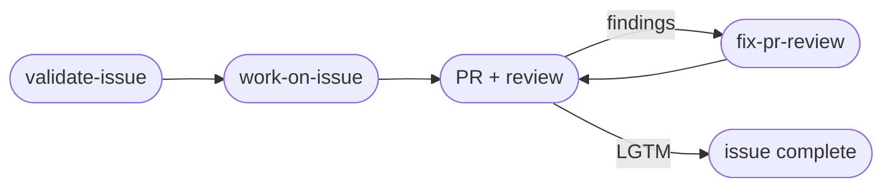

# rk-skills

Workflow skills for [Claude Code](https://claude.com/claude-code): GitHub issues, pull request (PR) review loops, docs syncing, and releases.

A skill is a reusable instruction file that teaches Claude Code one job (file an issue, cut a release). Trigger one by name and Claude follows its steps.

## Skills

Most workflow skills come in two forms: a **base** skill that does one step and stops, and a **`-loop`** variant that continues through review and re-review until the PR is approved.

Issues carry a **complexity score** (`C0` to `C100`) in the title and a `fableplan: yes|no` signal on the first line. The score routes the validate model, the build model and effort, and the first reviewer; `validate-issue` step 6 owns the band table. `fableplan` is `yes` at score 71 or higher, and a Fable 5.1 plan is then posted before the build. "Fable" skills hand part of the work to a subagent on the Fable 5.1 model; it runs at `high` by default and at `xhigh` only when you ask for it.

###…
