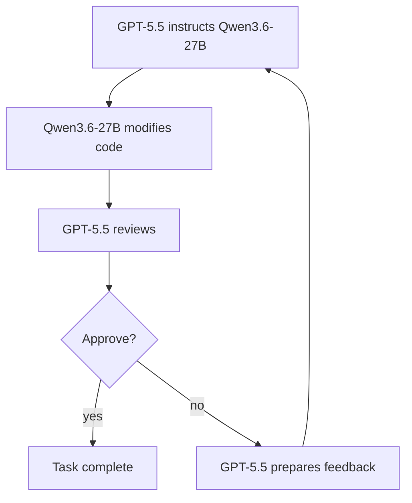

<h1 align="center">mixmod</h1>

It tests whether a strong supervisor model can supervise a cheaper local model while preserving result quality. The current benchmarked pairing is GPT-5.5 supervising Qwen3.6-27B on a single RTX 3090.

Follow [x.com/rndhouse](https://x.com/rndhouse) for project updates.

Early benchmark results show a **75.5% aggregate reduction in GPT-5.5 token usage** on the latest 10-instance SWE-bench Lite pool:

* Output tokens fell by 51.4%.
* Input tokens fell by 76.1%.
* Per-instance total token reductions ranged from 56.0% to 91.4%.

For the concrete supervisor/worker loop, see [Supervision](docs/supervision.md).

## Latest Benchmark Highlights

Latest report: [SWE-bench current default 10-instance snapshot](docs/latest-benchmark.md).
This is a selected SWE-bench Lite pool where GPT-5.5 could solve every task. Mixmod is testing token reduction, not capability improvement.

This table shows the…
