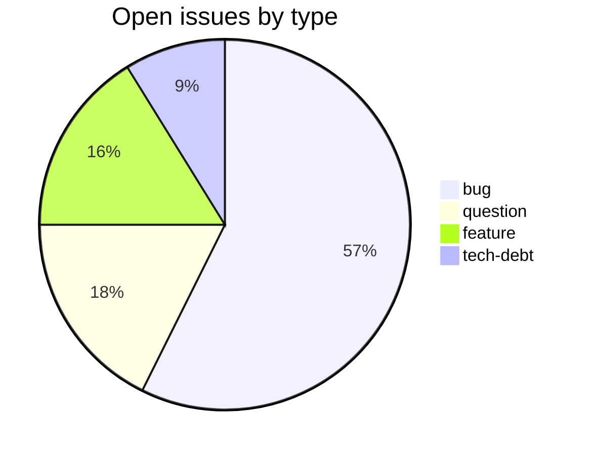
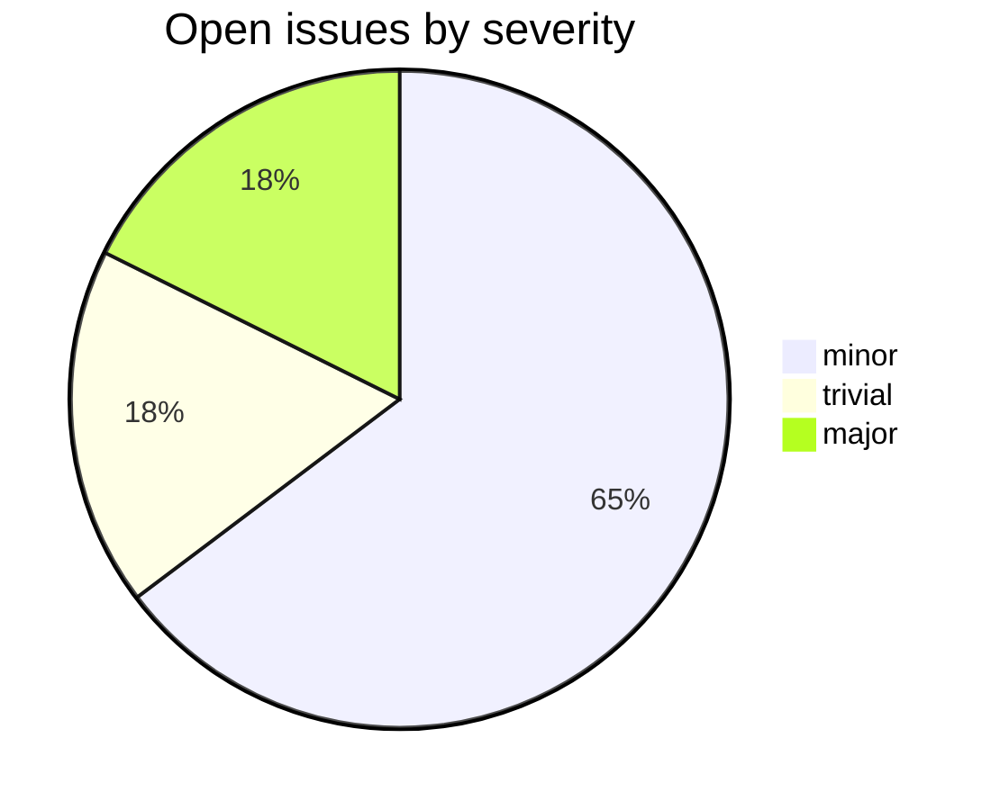

# csl-orig

CDSL **data-store** repository in the Sanskrit Lexicon project.
Data for all dictionaries of Cologne. Now all corrections are made in this git-based workflow.

## Tech Stack

- **Runtime**: Python
- **Build**: per-repo workflow
- **Pipeline**: see [csl-observatory tooling runbook](https://github.com/sanskrit-lexicon/csl-observatory/blob/main/runbook/cologne-tooling-runbook.md)

## Issues Overview

Snapshot 2026-05-29: **68** open, **2733** closed.

### By Milestone

| Milestone | Open | Closed | Total |
|---|---:|---:|---:|
| API Stability | 0 | 0 | 0 |
| User Experience | 0 | 0 | 0 |
| Data Quality | 0 | 0 | 0 |
| Developer Experience | 0 | 0 | 0 |
| Community | 0 | 0 | 0 |

### By Type

### By Severity

## GitHub Issue Conventions

Follows the [Cologne tooling-repo taxonomy](https://github.com/sanskrit-lexicon/csl-observatory/blob/main/runbook/cologne-tooling-runbook.md):

- **17 type labels** across 5 categories
- **4 severity levels**: trivial,…
