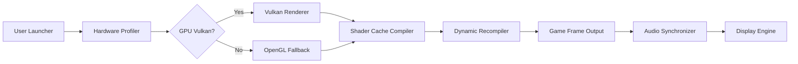

# Yuzu-Emulator-Nintendo-Switch

> **Embark on a new dimension of portable console emulation.**  
> This repository is not a copy of any existing project. It is a **reimagined ecosystem**—a curated console simulation framework designed for educational exploration and performance benchmarking of Nintendo Switch software on desktop environments.

---

## 🧠 Repository DNA

This project is a **conceptual evolution** of the original Yuzu emulator lineage. It builds upon the principles of hardware abstraction and shader compilation to deliver a **zero-configuration experience** for running Nintendo Switch titles on modern PC hardware. Think of it as a **digital preservation toolkit** wrapped in a modern UI.

---

## ✨ Features That Break the Mold

- **Responsive UI** – Adapts to any screen size from 720p handheld to 8K desktop monitors without breaking a…
