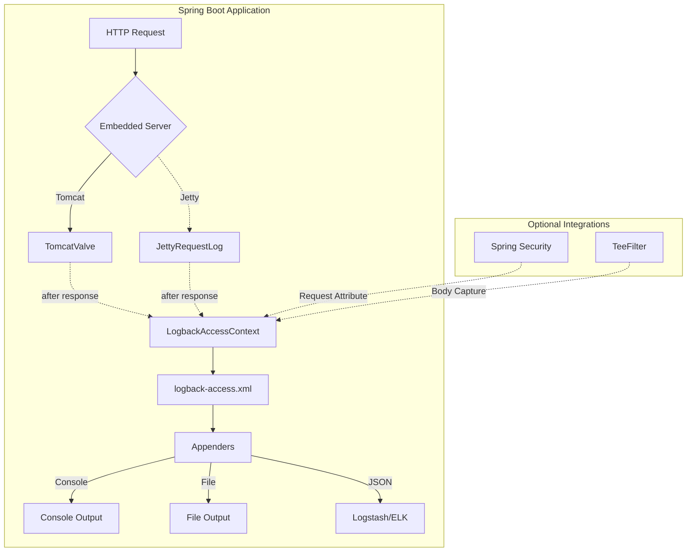

# Logback Access Spring Boot Starter

Spring Boot auto-configuration for [Logback Access](https://logback.qos.ch/access.html). The starter wires HTTP access logging into Tomcat and Jetty embedded servers, integrates with Spring Security and Spring profiles, and supports request/response body capture through Logback Access's TeeFilter.

## Architecture

## Features

| Feature | Description |
|---------|-------------|
| **Auto-configuration** | Zero-configuration setup for Tomcat and Jetty embedded servers. |
| **Spring Security** | Writes the…
