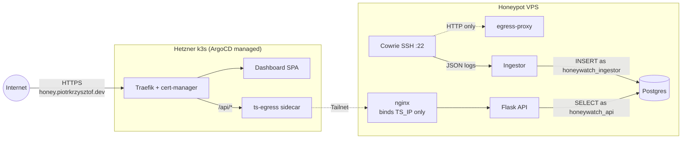

[Live dashboard](https://honey.piotrkrzysztof.dev) &middot; [Documentation](https://docs.honeywatch.piotrkrzysztof.dev)

SSH honeypot with attack visualization and threat analysis.

         alt="Honeywatch dashboard: live world map of SSH attacks."
         width="800">
  </a>

## Architecture

The honeypot VPS runs Cowrie, ingestor, Postgres, Flask API,
and an internal nginx that binds only to the Headscale tailnet interface.

Cowrie has no direct internet egress; outbound traffic is forced through
a tinyproxy sidecar (`egress-proxy`).

The…
