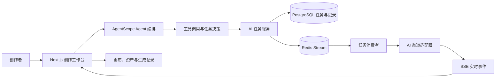

<h1 align="center">Novanova Studio</h1>

  AI Agent 驱动的视觉创作工作台：在一个持续保留上下文的空间里完成构思、生成、编辑、编排与沉淀。

## 联系我
- 商业授权
- 技术支持

<table align="center">
  <thead>
    <tr>
      <th align="center">联系作者</th>
      <th align="center">加入交流群</th>
    </tr>
  </thead>
  <tbody>
    <tr>
      <td align="center" width="33%">
      </td>
      <td align="center" width="33%">
      </td>
    </tr>
  </tbody>
</table>

## ✨ 项目定位

Novanova Studio 是面向独立创作者与视觉团队的 AI 创作工作台。它不是把图片、视频、提示词和生成记录拆散在多个工具中的集合，而是以**无限画布**作为创作上下文，以 **AI Agent** 作为理解意图、选择工具和推进任务的中枢。

创作者可以从一句自然语言目标或一组参考素材开始，在图片、视频和画布场景中持续对话、生成、编辑、比较与复用结果；生成记录、资产、提示词和画布节点会保留在同一条创作链路中。

## 🧠 Agent 贯穿创作链路

Agent 不是单独的聊天窗口，也不是一次性转发模型请求的接口。它贯穿从意图理解到结果沉淀的完整流程：

| 阶段 | Agent 与系统职责 | 创作体验…
