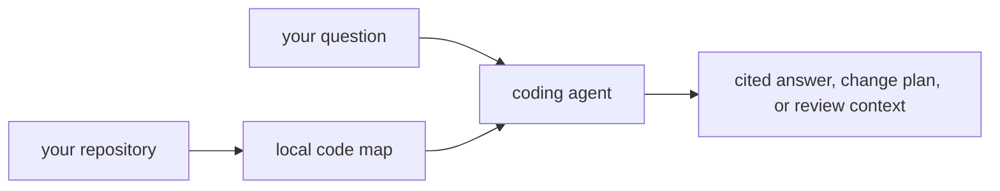

# CodeStory

**A local code map your coding agent can trust.**

CodeStory gives coding agents a durable understanding of the repository in
front of them: files, symbols, call paths, routes, snippets, and search evidence.
Answers stay tied to source locations, and incomplete coverage is reported as a
gap instead of being filled with guesses.

The released executable includes CodeRankEmbed Q8 and its accelerator engine.
There is no service to start, model to download, port to manage, or retrieval
setup to approve. Source, indexes, and queries stay local by default.

## What it adds

- **Repository grounding:** a compact map of the checkout, its languages,
  components, and important paths.
- **Symbol and impact navigation:** definitions, callers, references, trails,
  routes, and likely tests without repeated whole-tree scans.
- **Broad retrieval:** lexical, semantic, graph, and SCIP evidence combined into
  cited search results and answer packets.
- **Visible…
