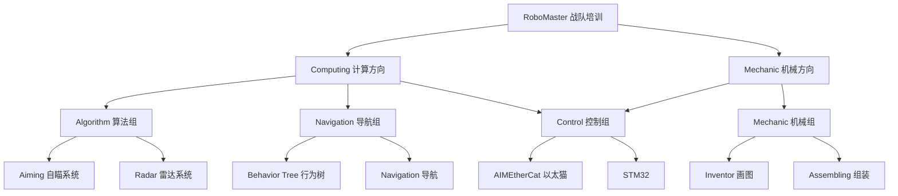

# RoboMaster 战队新成员培训课程

## 课程概述

本培训体系专为 RoboMaster 战队新成员设计，涵盖**算法/电控**和**机械**两大专业方向，旨在培养具备完整机器人开发能力的工程师。无论你选择哪个方向，都将获得扎实的理论基础和丰富的实践经验。

## 项目结构说明

本项目采用**路线/内容分离架构**，同时满足课程内容管理和学习路线指导的需求：

### `Contents/` - 课程内容库

存放所有教学资源和具体课程内容：

- `Python/` - Python 编程基础课程（3 节课）
- `Cpp/` - Cpp 编程基础课程
- `Linux/` - Linux 系统基础课程
- `OpenCV/` - 计算机视觉课程
- `ROS2/` - 机器人操作系统课程
- `Mechanic/` - 机械设计课程

### `Routes/` - 学习路线指南

按战队组别组织的个性化学习路径：

- `Computing/` - 算法/导航/控制方向学习路线
- `Computing/Algorithm` - 算法学习路线
- `Computing/Electronic` - 电控（嵌入式）学习路线
- `Mechanic/` - 机械方向学习路线

其中 `Computing/` 目录下的 `README.md` 文件会指导算法/导航/控制方向的同学需要共同学习的内容，依此类推

### 学习路线分支图

### 使用流程

1. **确定专业方向** → 进入对应的 `Routes/` 目录查看学习路线
2. **按路线学习** → 根据路线指导，进入 `Contents/` 目录学习具体课程
3. **专业深化** →…
