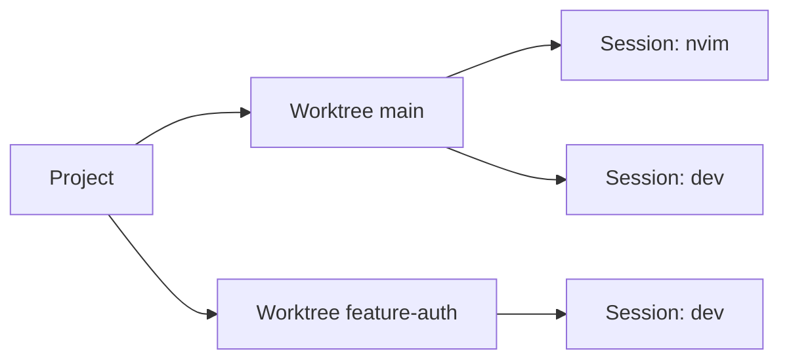

# wsx

**ENG** | [한국어](README.ko.md)

TUI workspace manager for git worktrees and tmux sessions.


## The core idea

Keep a live view of every project → worktree → tmux session in a sidebar.
Each session shows real-time state so you can see what needs attention without entering it.
Simply pressing `n` to iterate sessions where attention is required.

```
▼ project
  ▾ main * ↑2
      ◉ wsx_cc_main
  ▸ feature-auth ↓1
      ○ wsx_cc_auth
```



## Install

**macOS (Homebrew)**
```sh
brew tap vlwkaos/tap
brew install wsx
```

**macOS / Linux (cargo)**
```sh
cargo install wsx
```

**Build from source**
```sh
cargo install --path .
```

> Must be run inside a tmux session.

## Guide

| Feature | Screenshot |
|---|---|
| **Project config** `.gtrconfig` at repo root — post-create hook, auto-copy env files into new worktrees. Press `e` to view. | <img width="473" height="245" alt="image"…
