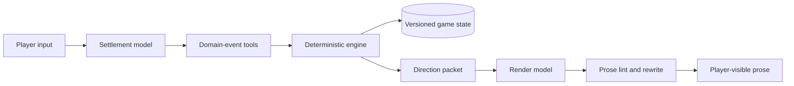

# fate-sandbox

[中文说明](https://github.com/Xerxes-2/fate-sandbox/blob/HEAD/README_ZH.md)

A local interactive narrative runtime for TYPE-MOON settings, built on the pi coding agent.

`fate-sandbox` treats the language model as an unreliable planner rather than a state store. A deterministic TypeScript engine validates domain events, advances time, protects hidden information, and records an auditable turn history. The model handles decisions and prose; the engine owns the game state.

> Experimental fan project. Fate and TYPE-MOON rights belong to their respective holders. See [License and fan-content notice](#license-and-fan-content-notice).

## Engineering overview

Each player turn runs through separate settlement and rendering passes:

The runtime enforces the boundaries that prompts cannot guarantee:

- **Domain events instead of raw patches.** Travel, wounds, purchases, secret…
