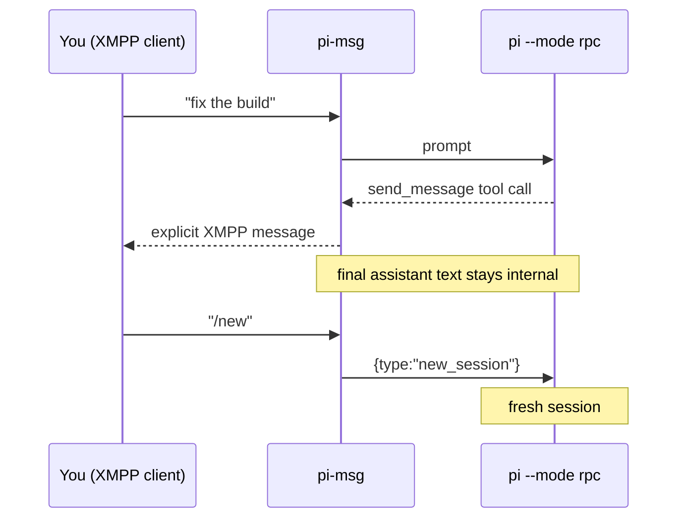

# pi-msg

Drive the [Pi](https://pi.dev) coding agent entirely over XMPP.

`pi-msg` launches `pi --mode rpc`, then bridges Pi's JSONL event stream to XMPP, with command interception for system commands like `/new`.

## Comms

## Supported features

- Sessions resuming across restarts, `/new` to reset
- Pi slash commands work over chat
- XMPP DMs and group chats
- Explicit outbound messages via `send_message`; final assistant text is internal
- Threaded replies via `reply_to`
- Room and 1:1 history via `read_messages`
- MAM supported
- File transfer (XEP-0363/0066)
- Reactions (XEP-0444)
- Presence updates
- Read receipts

## Commands

Your chat messages → routed to Pi:

| You send | Becomes |
| --- | --- |
| plain text | a prompt to the agent |
|…
